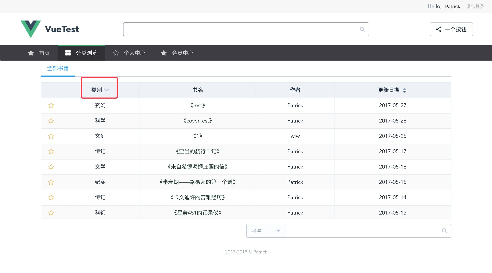
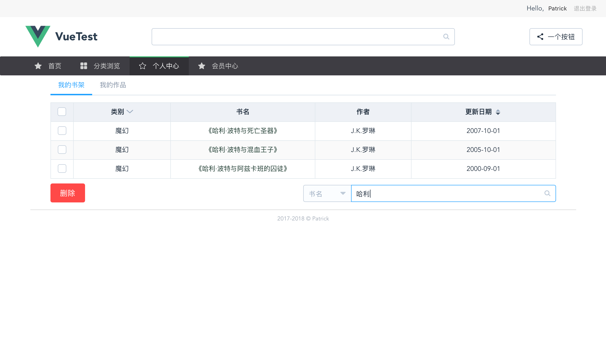
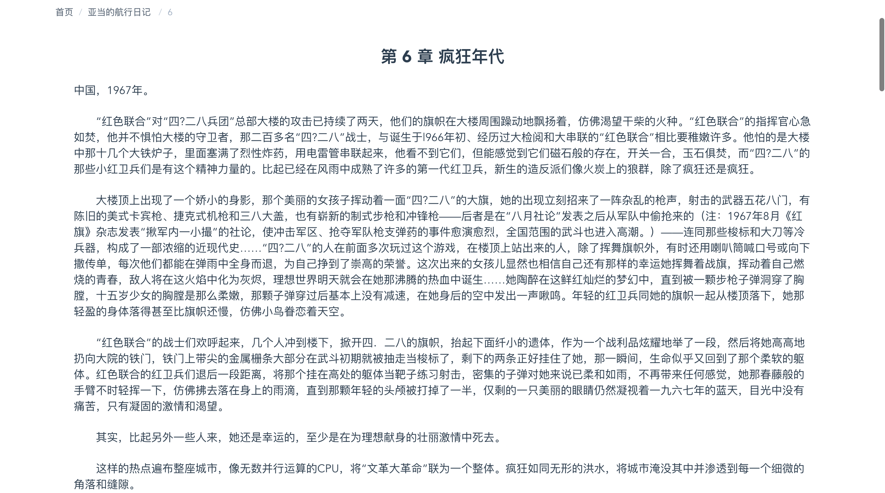
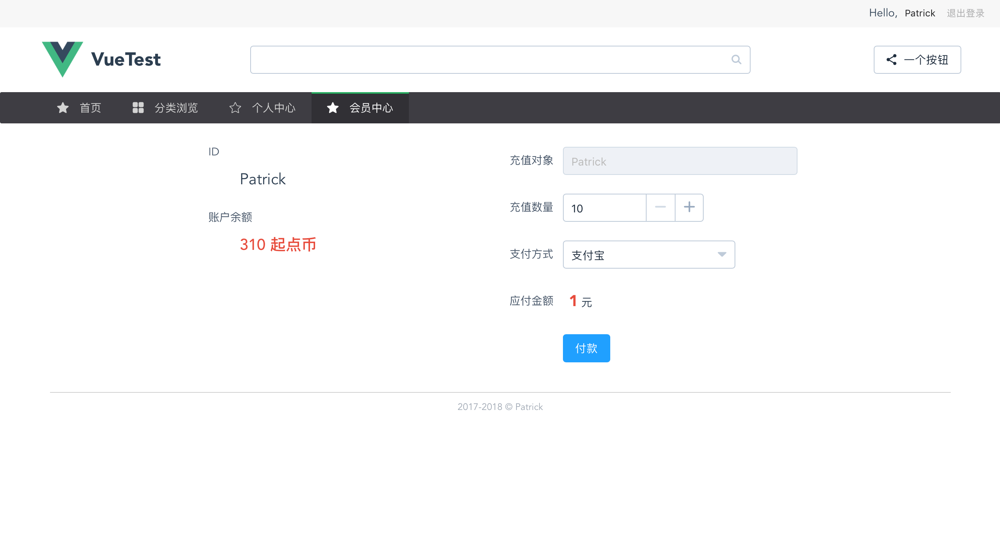
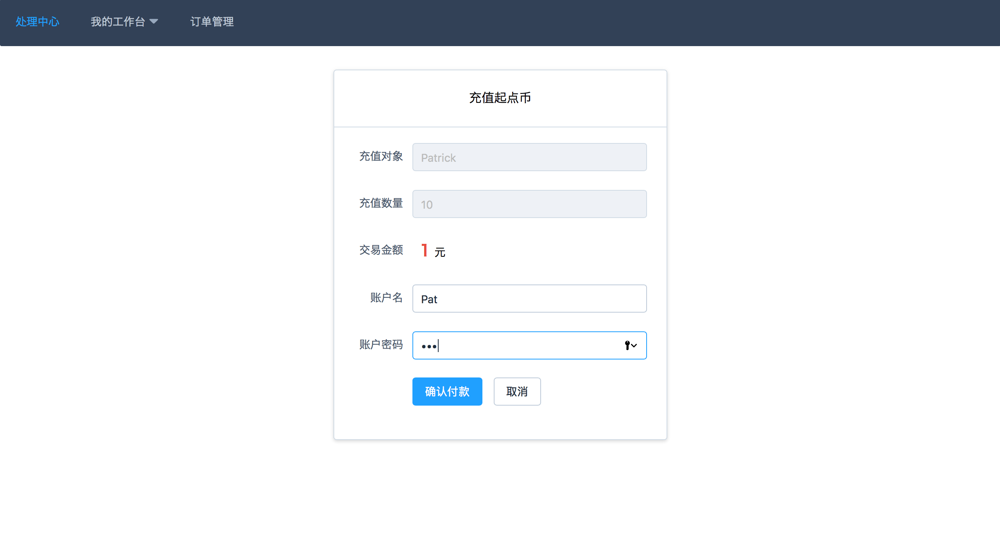
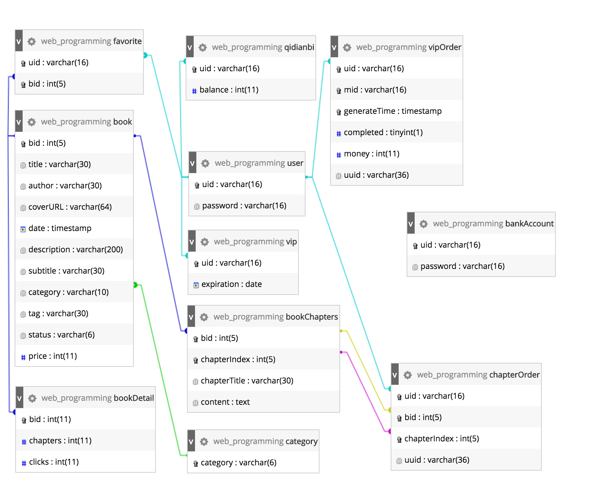

% 一个小说网站
% 031402434 庄逸锋
% 2017.06.05

# 功能概述

---


---



---



---


---


---



---



---



# 代码结构

---

## 语言框架

- 前端：Vue.js + ElementUI
- 后端：Koa

> JavaScript 是世界上最好的语言

---

## 目录结构

```
.
├── README.md
├── _config.yml
├── app.js
├── build
│   ├── build.js
│   ├── check-versions.js
│   ├── dev-client.js
│   ├── dev-server.js
│   ├── utils.js
│   ├── vue-loader.conf.js
│   ├── webpack.base.conf.js
│   ├── webpack.dev.conf.js
│   └── webpack.prod.conf.js
├── config
│   ├── dev.env.js
│   ├── index.js
│   └── prod.env.js
├── index.html
├── list.txt
├── module
│   ├── qiniu.js
│   └── sqlpool.js
├── package.json
├── src
│   ├── App.vue
│   ├── assets
│   │   ├── ads
│   │   ├── ebook
│   │   ├── logo.png
│   │   └── payment
│   ├── components
│   │   ├── adrow.vue
│   │   ├── favoriteTable.vue
│   │   ├── myWorksTable.vue
│   │   └── trendingCol.vue
│   ├── main.js
│   ├── pages
│   │   ├── allBooksPage.vue
│   │   ├── bookDetailPage.vue
│   │   ├── chapterPage.vue
│   │   ├── ebookPage.vue
│   │   ├── index.vue
│   │   ├── personalPage.vue
│   │   ├── recommendPage.vue
│   │   ├── trendingPage.vue
│   │   └── vipPage.vue
│   └── router
│       └── index.js
├── static
├── staticPages
│   ├── covers
│   │   ├── 01283d80d1061edb743cbd7587b46ef5
│   │   ├── default
│   │   ├── dfb79141d4874907b0e5953b9b193626
│   │   └── e02517c139098981b97f6a6e7cc99a63
│   └── index.html
└── test.js
```

# 数据库构成

---



# 没了


